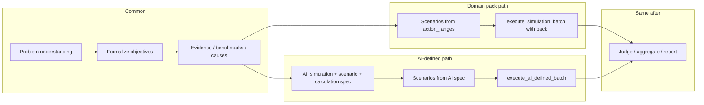

# Optional Run Mode: Domain Pack vs AI-Defined Simulation and Scenarios

Add a **run-mode choice** so the user can either (1) use a **domain pack** as today, or (2) choose **AI-defined simulation**, where the AI proposes what to simulate, how to build scenarios, and how to calculate; the system then runs that spec and the simulation layer "does its work" without a pack.

---

## 1. Run mode and API contract

**Two modes**:

| Mode            | Meaning                                              | Who defines simulations, scenarios, calculations                                                                   |
| --------------- | ---------------------------------------------------- | ------------------------------------------------------------------------------------------------------------------ |
| **Domain pack** | User selects a pack (e.g. FinancePack, SpatialPack). | Pack defines state/actions and `simulate()`; pipeline uses action_ranges and pack for scenarios/execution.         |
| **AI-defined**  | User chooses "AI defines simulation and scenarios."  | AI proposes simulation definition, scenario design, and calculation logic; system executes that spec in a sandbox. |

**API change** ([services/api/routers/runs.py](services/api/routers/runs.py)):

- **StartRunRequest**: Make `domain_pack` **optional**. Add an optional flag or enum, e.g. `simulation_mode: Literal["domain_pack", "ai_defined"] = "domain_pack"` (or infer: if `domain_pack` is null/empty and a flag is set, then ai_defined).
- **Validation**:
  - If `simulation_mode == "domain_pack"` (or `domain_pack` is provided): require `domain_pack`, resolve pack and version as today, set `run_spec["domain_pack_id"]`, `run_spec["domain_pack_version_id"]`, and `run.domain_pack_version_id`.
  - If `simulation_mode == "ai_defined"` (or no domain pack selected): do **not** require a domain pack. Create the run with `domain_pack_version_id=None` and set e.g. `run_spec["simulation_mode"] = "ai_defined"`. DB already has `Run.domain_pack_version_id` as optional in the model; confirm migration allows NULL for `runs.domain_pack_version_id` and add a migration if it is currently NOT NULL.

**Run record**: For ai_defined runs, `domain_pack_version_id` stays NULL; all context lives in `run_spec` (e.g. `simulation_mode`, `ai_simulation_spec`, `problem_understanding`, `candidate_solutions`).

---

## 2. Workflow branch on mode

In [services/orchestrator/workflows/simulation_run.py](services/orchestrator/workflows/simulation_run.py), branch after problem understanding (and optional solution proposal) based on `run_spec.get("simulation_mode")` or presence of `run_spec.get("domain_pack_id")`:

- **Common**: Problem understanding (if you add it), formalize objectives, evidence pack, benchmarks, model_causes. For ai_defined, formalize_objectives may work without a pack (e.g. no pack metrics; use generic objectives from AI).
- **Domain pack path**: As today: `generate_structured_scenarios(run_spec)` using action_ranges (and optional candidate_solutions), then `execute_simulation_batch(domain_pack_id, domain_pack_version, scenarios)`.
- **AI-defined path**: New steps: (1) Activity that asks AI to produce **simulation + scenario + calculation spec**. (2) Activity that generates scenarios from that spec. (3) New activity **execute_ai_defined_batch** that runs the calculation for each scenario (sandboxed). Output format must match what Judge expects (list of outcomes with metrics).
- **After**: Same Judge scoring, optimizer (if used), aggregation, report, seal. Report can include which mode was used and, for ai_defined, a summary of the AI spec.

---

## 3. AI-defined spec and who does what

**New activity: produce AI simulation spec** (e.g. in orchestrator activities).

- **Input**: `run_spec` with at least `objective_spec.description`, and optionally `problem_understanding`, `objectives`, `constraints`.
- **Output**: Written into `run_spec["ai_simulation_spec"]`, with a structure such as:
  - **simulation_definition**: short description of what is being modeled (inputs, outputs, meaning).
  - **state_schema**: list or dict of state parameters and types/ranges (so scenarios can have consistent state).
  - **action_schema**: list or dict of action parameters and types/ranges (levers to vary).
  - **scenario_design**: how many scenarios, how to sample (e.g. "grid over action_schema", "random", or explicit list of (state, actions) suggestions).
  - **calculation_spec**: how to go from (state, actions) to numeric outcomes. Two practical options:
    - **Option A (recommended)**: AI outputs **executable code** (e.g. a single Python function `evaluate(state: dict, actions: dict) -> dict` returning metric names and values). The system runs this in a **sandbox** (restricted globals, timeout, no I/O) per scenario. Reproducible if the same spec is re-run.
    - **Option B**: AI outputs a **structured DSL** (e.g. formulas as expression trees or a small JSON schema) that a small interpreter evaluates. Safer but requires implementing the interpreter.

Recommendation: implement **Option A** first (generated Python in sandbox). The activity calls the AI with a prompt that includes the problem and asks for a single function in a fixed signature and a clear JSON-like return (metric names and numbers). Validate and store the code in `run_spec["ai_simulation_spec"]["evaluate_code"]` (or similar). If the AI returns invalid code, retry or fall back to a minimal spec and log.

**New activity: generate scenarios for AI-defined mode**.

- **Input**: `run_spec` with `ai_simulation_spec` (state_schema, action_schema, scenario_design).
- **Output**: List of scenarios in the **same shape** as today: `{ "run_id", "state", "actions", "fidelity", "seed", "scenario_hash", "scenario_id" }`. State and actions conform to the AI-defined schemas. Scenario design (e.g. "50 scenarios, random over action ranges") is implemented here (e.g. random/latin-hypercube over action_schema ranges).

**New activity: execute_ai_defined_batch**.

- **Input**: `run_spec` (with `ai_simulation_spec`), `scenarios: List[Dict]`.
- **Behavior**: For each scenario, run the AI-provided calculation in a **sandbox** (e.g. `exec` of the evaluate function in a restricted namespace, with a timeout per scenario). Build an **outcome** dict per scenario in the same shape as domain-pack outcomes (e.g. `scenario_id`, `run_id`, `outcome`: `{ "metrics": [ { "name", "value" } ], ... }`, `status`: "completed" | "failed") so Judge and existing aggregation need no change.
- **Safety**: Restrict builtins, no file/network, limit execution time (e.g. 5–10 s per scenario). On exception or timeout, mark that scenario as failed and record the error.

---

## 4. Where each piece lives

| Piece                           | Location                                                                                                                                   | Notes                                                                                                                                                                                                                    |
| ------------------------------- | ------------------------------------------------------------------------------------------------------------------------------------------ | ------------------------------------------------------------------------------------------------------------------------------------------------------------------------------------------------------------------------ |
| Run mode in API                 | [services/api/routers/runs.py](services/api/routers/runs.py)                                                                               | Optional `domain_pack`; `simulation_mode` or infer ai_defined when no pack; create run with nullable `domain_pack_version_id` for ai_defined.                                                                            |
| DB migration                    | New Alembic revision                                                                                                                       | Ensure `runs.domain_pack_version_id` is nullable if it is currently NOT NULL.                                                                                                                                            |
| Workflow branch                 | [services/orchestrator/workflows/simulation_run.py](services/orchestrator/workflows/simulation_run.py)                                     | After evidence/causes, branch on `simulation_mode` or `domain_pack_id`. Pack path: current scenario generation + `execute_simulation_batch`. AI path: new activities for spec, scenario gen, `execute_ai_defined_batch`. |
| AI simulation spec activity     | New file or [services/orchestrator/activities/](services/orchestrator/activities/) (e.g. `problem_and_solutions.py` or `ai_simulation.py`) | LLM call returning simulation_definition, state_schema, action_schema, scenario_design, evaluate_code (or DSL). Validate and store in run_spec.                                                                          |
| Scenario generation for AI mode | Same or pipeline                                                                                                                           | New function or branch in pipeline that builds scenario list from `ai_simulation_spec.state_schema` / `action_schema` and `scenario_design`.                                                                             |
| execute_ai_defined_batch        | New activity (orchestrator or a small dedicated module)                                                                                    | Load spec from run_spec; for each scenario run sandboxed evaluate(state, actions); return list of outcomes in Judge-compatible shape.                                                                                    |
| Sandbox executor                | New small module (e.g. under services/orchestrator or a shared `compute` helper)                                                           | Run user-provided Python code with restricted globals and timeout. Return metrics dict or raise.                                                                                                                         |

---

## 5. Frontend: option to select mode

**Web app** ([apps/web/](apps/web/)):

- When starting a run, show a **mode selector**:
  - **"Use a domain pack"**: show existing domain pack dropdown (current behavior). Require selection.
  - **"Let AI define simulation and scenarios"**: no pack selection; send `simulation_mode: "ai_defined"` (and no or null `domain_pack`) in the start request.
- Run config (max scenarios, etc.) can stay the same; for ai_defined, the AI spec can respect a scenario budget from run_spec.

---

## 6. Summary flow for AI-defined mode

1. User selects "AI defines simulation and scenarios" and submits a problem (prompt).
2. API creates run with `simulation_mode=ai_defined`, `domain_pack_version_id=NULL`.
3. Workflow: problem understanding (optional) → formalize objectives (generic) → evidence/causes (optional) → **produce_ai_simulation_spec** → **generate_scenarios_ai_defined** → **execute_ai_defined_batch** → Judge scores outcomes → aggregate → report (include mode and spec summary).
4. Simulation "does its work" in `execute_ai_defined_batch` via the sandboxed AI-generated calculation; no domain pack is used.

Domain pack remains the other option: user selects a pack, and the existing pipeline (pack-based scenarios + Sim Fabric + pack.simulate()) runs unchanged.