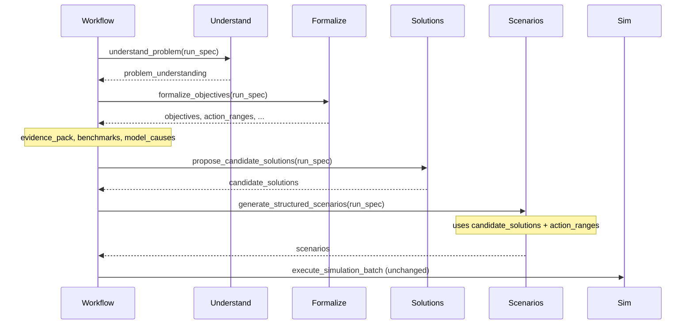

# Problem Understanding + Best-AI Solutions in Existing System

Integrate into the current GSIP flow: (1) **problem understanding** with a small AI (root cause, goal, expectation, to-do list of sub-problems), (2) **candidate solution proposal** with the best AI, (3) **scenario generation** driven by those solutions, (4) **simulation unchanged** (calculations only) and best output as today.

---

## Target flow (insertions in current pipeline)

- **Problem understanding**: runs first; writes structured output into `run_spec["problem_understanding"]`.
- **Formalization**: unchanged in spirit; can optionally consume `problem_understanding` to improve objectives/constraints.
- **Solution proposal**: new activity after evidence/causes; writes `run_spec["candidate_solutions"]`; uses configurable “best” model.
- **Scenario generation**: extended to use `candidate_solutions` when present (solutions become primary scenario seeds; keep some exploration).
- **Simulation**: no change (domain packs only; calculations only; best output as today).

---

## 1. Problem-understanding activity (small AI)

**Purpose**: From the user’s raw problem text, produce a structured breakdown: root cause, main goal, user expectation, and a short to-do list of sub-problems.

**Where**: New orchestrator activity (e.g. in a new module or under [services/orchestrator/activities/](services/orchestrator/activities/)).

**Contract**:

- **Input**: `run_spec` (at least `objective_spec.description`, optional `domain_pack`).
- **Output**: Dict to be stored in `run_spec["problem_understanding"]`:
  - `root_cause`: str (brief)
  - `main_goal`: str
  - `user_expectation`: str
  - `sub_problems`: list of `{ "id": str, "description": str }` (to-do list of problems)

**Implementation**:

- Call a single LLM with a structured prompt (and JSON output) to produce these four fields.
- Use a **small/fast** model by default (e.g. `gpt-4o-mini`) to keep cost and latency low. Make the model name configurable via orchestrator config (e.g. `PROBLEM_UNDERSTANDING_MODEL`).
- Reuse the same env-based API key pattern as the formalizer: [services/orchestrator/activities/formalizer.py](services/orchestrator/activities/formalizer.py) (e.g. `OPENAI_API_KEY` / `ANTHROPIC_API_KEY`). If no key or call fails, return a minimal fallback (e.g. `main_goal` = user prompt, `sub_problems` = single item from prompt) so the pipeline never blocks.

**Workflow wiring**: Run this as the **first** step in [services/orchestrator/workflows/simulation_run.py](services/orchestrator/workflows/simulation_run.py), before `formalize_objectives`. After the activity returns, merge the result into `run_spec`, call `update_run_spec(run_id, run_spec)`, and record a stage (e.g. `problem_understanding`).

---

## 2. Formalizer optional use of problem understanding

**Purpose**: Let formalization be informed by the structured problem breakdown (better objectives/constraints).

**Where**: [services/orchestrator/activities/pipeline.py](services/orchestrator/activities/pipeline.py) — `formalize_objectives(run_spec)` and/or [services/orchestrator/activities/formalizer.py](services/orchestrator/activities/formalizer.py).

**Change**: When building the prompt or heuristic input for objective formalization, if `run_spec.get("problem_understanding")` exists, pass:

- `main_goal` and/or `user_expectation` into the question/context,
- optionally `sub_problems` as hints for constraints or metrics.

No change to the formalizer’s output schema; only enrich input so objectives/constraints/action_ranges better match the user’s intent.

---

## 3. Candidate-solution proposal activity (best AI)

**Purpose**: From problem understanding + formalized objectives + action space, produce a list of **candidate solutions** (strategies or concrete action suggestions) that the simulation will then try.

**Where**: New orchestrator activity (same area as problem understanding).

**Contract**:

- **Input**: `run_spec` containing at least:
  - `problem_understanding`
  - `objectives`, `constraints`, `action_ranges`
  - `domain_pack` (and optionally domain pack metrics list)
- **Output**: Dict to be stored in `run_spec["candidate_solutions"]`:
  - `solutions`: list of:
    - `id`: str
    - `label`: str (short name)
    - `description`: str (one or two sentences)
    - `suggested_actions`: dict mapping action parameter names to values or ranges (e.g. `{"weight_spy": 0.6, "weight_bnd": 0.3}` or `{"weight_spy": {"min": 0.5, "max": 0.7}}`). Must conform to the domain pack’s action space so scenarios can be built from them.

**Implementation**:

- Single LLM call with a structured prompt that includes:
  - Problem summary (root cause, main goal, user expectation, sub_problems),
  - Objectives and constraints,
  - Available action parameters and their ranges (from `action_ranges` or domain pack).
- Ask the model to output 5–10 candidate solutions with the structure above; parse JSON and validate `suggested_actions` against `action_ranges`.
- Use the **best** model: make it configurable (e.g. `SOLUTION_PROPOSAL_MODEL=gpt-4o` or equivalent Anthropic). Default to a strong model (e.g. `gpt-4o` or `claude-3-5-sonnet`) so “solution section uses the best AI” as requested.
- Same API key pattern as formalizer; on failure or missing key, return an empty or single generic solution so scenario generation can fall back to existing exploration-only behavior.

**Workflow wiring**: Run this **after** evidence pack, benchmarks, and `model_causes`, and **before** `generate_structured_scenarios`. Merge result into `run_spec`, persist with `update_run_spec`, record stage (e.g. `solution_proposal`).

---

## 4. Scenario generation driven by candidate solutions

**Purpose**: When `run_spec` contains `candidate_solutions`, generate scenarios **from** those solutions (each solution becomes one or more scenarios), plus keep some exploration for the optimizer.

**Where**: [services/orchestrator/activities/pipeline.py](services/orchestrator/activities/pipeline.py) — `generate_structured_scenarios(run_spec)`.

**Current behavior**: Builds scenarios from grid + LHS + random + boundary using `action_ranges` and `initial_state` only ([pipeline.py](services/orchestrator/activities/pipeline.py) ~116–201).

**Change**:

- If `run_spec.get("candidate_solutions", {}).get("solutions")` is present and non-empty:
  - For each candidate solution, convert `suggested_actions` into at least one scenario (state = `initial_state`, actions = resolved from suggested_actions; if a value is a range, sample inside it or use midpoint for a “center” scenario).
  - Optionally add 1–2 small variations per solution (e.g. slight perturbation of actions) to get multiple scenarios per candidate.
  - Allocate a portion of the scenario budget to these “solution-driven” scenarios (e.g. 50–60%).
  - Use the remainder for existing strategies (grid/LHS/random/boundary) so the optimizer can still explore.
- If no candidate solutions, behavior stays as today (100% exploration).
- Ensure every scenario still has `scenario_hash`, `run_id`, `state`, `actions`, `fidelity`, `seed`, and optionally a tag like `solution_id` so the report can show which solution each scenario came from.

---

## 5. Simulation and best output (unchanged)

- **Execution**: [services/sim_fabric/executor.py](services/sim_fabric/executor.py) and domain packs remain the only place where numeric outcomes are produced. No LLM in the simulation path.
- **Scoring and ranking**: Judge and optimizer behave as today; they already produce the best scenario(s) and scores.
- **Report**: Extend the report payload in [simulation_run.py](services/orchestrator/workflows/simulation_run.py) (around the `report_payload` dict) to include:
  - `problem_understanding`
  - `candidate_solutions`
  - Optional: mapping from `scenario_id` or scenario hash to `solution_id` so the UI or downstream can show “best solution” per candidate. This can be derived from scenario metadata if you tag solution-driven scenarios with `solution_id`.

No change to how the “best output” is computed—only to what is stored and exposed (problem breakdown + which scenarios corresponded to which proposed solutions).

---

## 6. Configuration

**Where**: [services/orchestrator/config.py](services/orchestrator/config.py) (or env-only if you prefer no new settings file keys).

**Suggested env vars** (with defaults):

- `PROBLEM_UNDERSTANDING_MODEL`: model for problem understanding (e.g. `gpt-4o-mini`). Small/fast.
- `SOLUTION_PROPOSAL_MODEL`: model for candidate solutions (e.g. `gpt-4o` or `claude-3-5-sonnet-20241022`). Best AI for solutions.
- Existing `OPENAI_API_KEY` / `ANTHROPIC_API_KEY` used for both; if you need provider-specific keys for “best” vs “small”, add e.g. `OPENAI_API_KEY` and `ANTHROPIC_API_KEY` and choose provider per step by model name prefix or a small config map.

---

## 7. Workflow order summary (simulation_run.py)

1. **New**: `understand_problem(run_spec)` → merge into run_spec, update_run_spec, record stage.
2. **Existing**: `formalize_objectives(run_spec)` (optionally using problem_understanding).
3. **Existing**: evidence_pack, create_evidence_pack, select_benchmarks, update_run_spec, record stage.
4. **Existing**: `model_causes(run_spec)`.
5. **New**: `propose_candidate_solutions(run_spec)` → merge into run_spec, update_run_spec, record stage.
6. **Existing**: `generate_structured_scenarios(run_spec)` (now solution-aware).
7. **Existing**: persist_scenarios_and_instances; then optimization loop, finalists, robustness, aggregate, report, seal.

---

## 8. API and UI (optional)

- **Run response**: `_run_to_response` in [services/api/routers/runs.py](services/api/routers/runs.py) currently returns fields from `run_spec`. If you store `problem_understanding` and `candidate_solutions` in `run_spec`, you can expose them by adding optional keys to the response (e.g. `problem_understanding`, `candidate_solutions`) so the frontend can show “what we understood” and “solutions we’re trying” before and during the run.
- **SSE**: No change required; existing stage/counter/candidate events remain. Optionally emit a new event when problem_understanding or candidate_solutions are ready so the UI can display them early.

---

## 9. Files to add or touch

| Item                                                                                                   | Action                                                                                                                                                                                              |
| ------------------------------------------------------------------------------------------------------ | --------------------------------------------------------------------------------------------------------------------------------------------------------------------------------------------------- |
| New module or file for “understanding + solution” activities                                           | Add e.g. `services/orchestrator/activities/problem_and_solutions.py` with `understand_problem` and `propose_candidate_solutions` activities (LLM calls, parsing, fallbacks).                        |
| [services/orchestrator/activities/**init**.py](services/orchestrator/activities/__init__.py)           | Export the two new activities.                                                                                                                                                                      |
| [services/orchestrator/activities/pipeline.py](services/orchestrator/activities/pipeline.py)           | In `formalize_objectives`, optionally pass `problem_understanding` into formalizer. In `generate_structured_scenarios`, add branch that builds scenarios from `candidate_solutions` when present.   |
| [services/orchestrator/activities/formalizer.py](services/orchestrator/activities/formalizer.py)       | Optional: accept problem_understanding in a wrapper or in `formalize_objective` and use main_goal / sub_problems in the prompt.                                                                     |
| [services/orchestrator/workflows/simulation_run.py](services/orchestrator/workflows/simulation_run.py) | Insert problem-understanding step first; insert solution-proposal step after model_causes and before scenario generation; extend report_payload with problem_understanding and candidate_solutions. |
| [services/orchestrator/config.py](services/orchestrator/config.py)                                     | Add PROBLEM_UNDERSTANDING_MODEL and SOLUTION_PROPOSAL_MODEL (with defaults).                                                                                                                        |
| [.env.example](.env.example)                                                                           | Document the new env vars and “best” model recommendation for solutions.                                                                                                                            |

---

## 10. Testing and fallbacks

- **Tests**: Add unit tests for `understand_problem` and `propose_candidate_solutions` with mocked LLM (or no key) to assert fallback structure. Add a test that `generate_structured_scenarios` with mock `candidate_solutions` produces scenarios whose actions align with the suggested_actions.
- **Fallbacks**: If problem understanding fails → set `problem_understanding` to `{ "main_goal": prompt, "sub_problems": [{"id": "1", "description": prompt}] }`. If solution proposal fails → set `candidate_solutions` to `{ "solutions": [] }` so scenario generation uses 100% exploration (current behavior).

This keeps the pipeline always runnable while adding the new AI steps and using the best AI only for the solution section, with simulation remaining calculation-only and best output unchanged in logic.