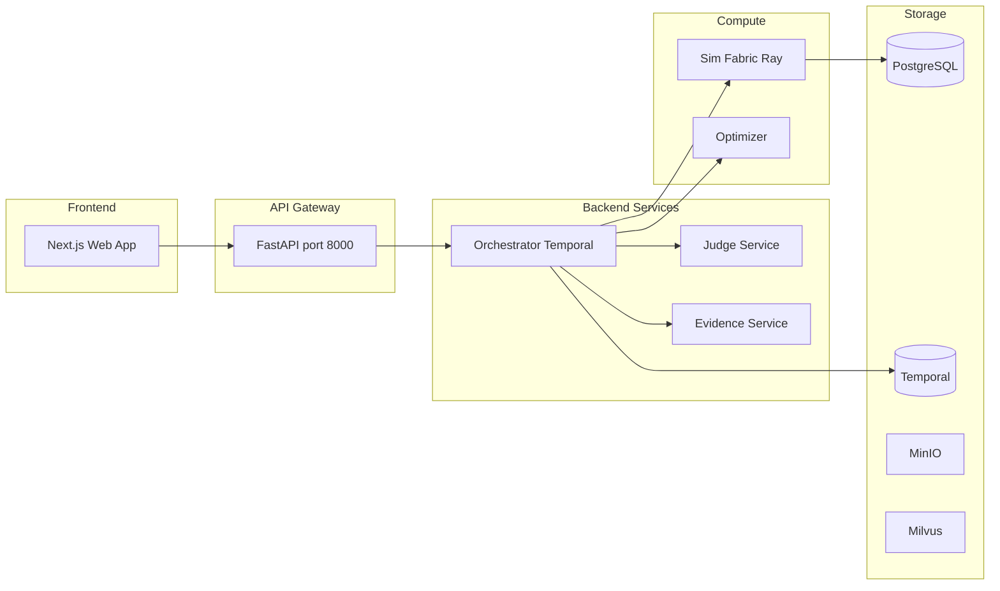
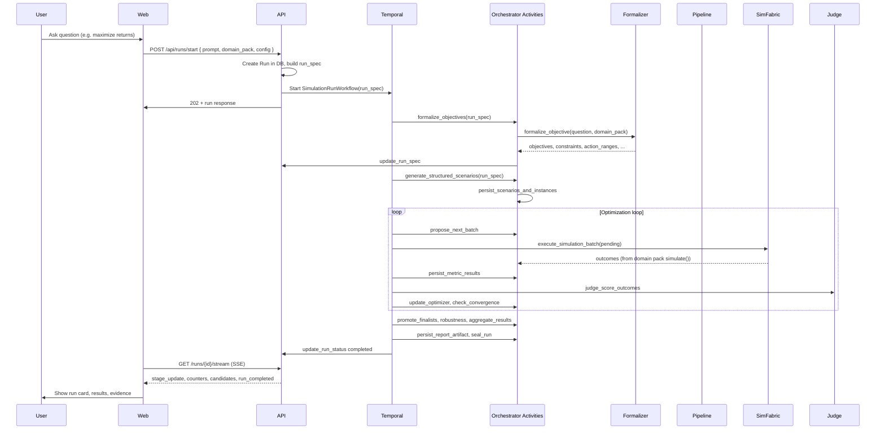

# How the Simulation Is Built and How a Question Flows

This document describes the existing GSIP architecture: how the model is built and what happens when you ask a question.

---

## 1. High-level architecture

The system is the **General Simulation Intelligence Platform (GSIP)**. It turns a natural-language goal into a formal optimization over a scenario space, runs simulations via domain packs, scores outcomes with the Judge, and iterates with an optimizer until convergence.

- **Entry point**: [services/api/main.py](../services/api/main.py) — FastAPI app; runs router under `/api`.
- **Orchestration**: [services/orchestrator/workflows/simulation_run.py](../services/orchestrator/workflows/simulation_run.py) — single long-lived Temporal workflow (`SimulationRunWorkflow`) that runs the whole pipeline.
- **Execution**: [services/sim_fabric/executor.py](../services/sim_fabric/executor.py) — Ray workers that load domain packs and run `simulate(state, actions, fidelity, seed)`.
- **Scoring**: Judge service applies rubric-based scoring to simulation outcomes.
- **Optimization**: Optimizer (Bayesian/evolutionary) proposes next batches of scenarios; workflow loops until convergence or limits.

---

## 2. What happens when you "ask a question"

End-to-end flow:

**User question → Objective formalization → Scenario generation → Simulation execution → Scoring & ranking → Optimization loop → Final report (and optional evidence).**

### 2.1 User asks in the UI

- **Where**: [apps/web/src/components/chat/ChatComposer.tsx](../apps/web/src/components/chat/ChatComposer.tsx)
- User types a goal (e.g. "Maximize portfolio returns while keeping risk low") and sends.
- The app `POST`s to `/api/runs/start` with:
  - `prompt`: the question text
  - `domain_pack`: e.g. `"FinancePack"`, `"SpatialPack"`
  - `config`: e.g. `maxScenarios`, `maxWallTime`, `fidelityPolicy`

*(If the web app runs standalone, it may need a proxy or env base URL pointing to the FastAPI gateway.)*

### 2.2 API creates the run and starts the workflow

- **Where**: [services/api/routers/runs.py](../services/api/routers/runs.py) — `POST /api/runs/start`
- Validates project and domain pack (DB); creates a `Run` in PostgreSQL with `run_spec`.
- `run_spec` includes:
  - `objective_spec.description` = user `prompt`
  - `domain_pack` / `domain_pack_version` / ids
  - `cost_limits` (from `config`: max scenarios, wall time, etc.)
  - `stages`, `counters`, `candidates`
- Starts **Temporal** workflow `SimulationRunWorkflow.run(workflow_run_spec)` in the background (task queue `gsip-main`) and returns the run response (e.g. run id, status, objective summary) immediately (202).

### 2.3 Orchestrator: formalize objectives (first activity)

- **Where**: [services/orchestrator/activities/pipeline.py](../services/orchestrator/activities/pipeline.py) — `formalize_objectives(run_spec)`
- Reads the user question from `run_spec["objective_spec"]["description"]` and `run_spec["domain_pack"]`.
- Calls [services/orchestrator/activities/formalizer.py](../services/orchestrator/activities/formalizer.py) — `formalize_objective(question, domain_pack, ...)` which:
  - Uses domain keyword heuristics and optional LLM to produce a `FormalizedObjective` (metrics, direction, constraints, `action_ranges`, `initial_state`).
- Returns a dict: `objectives`, `constraints`, `context`, `action_ranges`, `initial_state`.
- Workflow **updates** `run_spec` with this result and persists via `update_run_spec`.

So: **the question drives the rest of the pipeline through this formalized spec** (what to maximize/minimize, over which levers and ranges).

### 2.4 Evidence pack and cause modeling

- Workflow runs `build_evidence_pack` and `create_evidence_pack` (evidence service), then `select_benchmarks` for the domain.
- Then `model_causes(run_spec)` — MoE committee models causes/levers; result is used later in the report.

### 2.5 Scenario generation

- **Where**: [services/orchestrator/activities/pipeline.py](../services/orchestrator/activities/pipeline.py) — `generate_structured_scenarios(run_spec)`
- Uses formalized `action_ranges`, `initial_state`, `objectives`, `constraints`, and a scenario budget.
- Builds many scenarios (e.g. grid, Latin hypercube, random, boundary) with `state`, `actions`, `fidelity`, `seed`, and a deterministic `scenario_hash`.
- Scenarios are persisted via `persist_scenarios_and_instances`.

### 2.6 Optimization loop (core simulation cycle)

The workflow enters a **while** loop until convergence or cost limits:

1. **Propose batch**: `propose_next_batch(optimizer_state, batch_size, run_id)` — optimizer suggests next scenarios (e.g. Bayesian/evolutionary).
2. **Persist** new scenarios/instances.
3. **Cache lookup**: `fetch_cached_outcomes(batch)` — reuse results for same scenario hash if any.
4. **Execute simulations**: For uncached scenarios, `execute_simulation_batch(domain_pack_id, domain_pack_version, pending)`:
   - Implemented via **Sim Fabric** [services/sim_fabric/executor.py](../services/sim_fabric/executor.py): Ray workers load the domain pack and call `pack.simulate(state, actions, fidelity, seed)` → `OutcomeBundle`.
5. **Persist metric results** for each outcome.
6. **Judge scoring**: `judge_score_outcomes(run_id, outcomes, rubric, benchmarks)` — deterministic scores; results persisted.
7. **Update optimizer**: `update_optimizer(optimizer_state, scored)` and `persist_optimizer_step`.
8. **Convergence check**: `check_convergence(optimizer_state, all_scored)`; if converged or limits hit, exit loop.

So the "simulation" in the loop is: **optimizer proposes scenarios → Sim Fabric runs domain-pack simulations → Judge scores → optimizer state updated → repeat.**

### 2.7 Finalists, robustness, report, seal

- **Promote finalists**: Top scenarios (e.g. top 5) are re-run at mid/high fidelity with replicates.
- **Robustness tests**: Extra scenarios around finalists; run and score again.
- **Aggregate**: `aggregate_results(run_id, all_scored, objectives)` → summary, best score.
- **Report**: `persist_report_artifact(run_id, report_payload)` (includes summary, benchmarks, cause model, evidence_pack_id).
- **Seal**: `seal_run(run_id)`, `update_run_status(run_id, "completed")`.

### 2.8 How the user sees progress and result

- **SSE**: `GET /api/runs/{run_id}/stream` streams stage updates, counters, candidates, best_changed, and finally `run_completed` with the full run response.
- **Polling**: `GET /api/runs/{run_id}` returns current run state (status, stages, counters, candidates, current_best).
- The web app can subscribe to the stream and update the UI (e.g. run card, workspace tabs) from these events.

---

## 3. How the "simulation" is built (components)

### 3.1 Domain packs (what actually simulates)

- **Contract**: [compute/domain_packs/sdk/base.py](../compute/domain_packs/sdk/base.py) — each pack implements:
  - `state_schema`, `action_schema`
  - `simulate(state, actions, fidelity, seed)` → `OutcomeBundle` (metrics, etc.)
  - Optional: `score`, `feasibility`, `cost_model`
- **Registry**: [compute/domain_packs/sdk/registry.py](../compute/domain_packs/sdk/registry.py) — creates pack instances by name/version.
- **Packs**: ToyPack, FinancePack, SpatialPack under [compute/domain_packs/](../compute/domain_packs/). All numeric outcomes come from these implementations (no LLM fabrication of simulation results).

### 3.2 Sim Fabric (execution layer)

- **Ray workers**: [services/sim_fabric/executor.py](../services/sim_fabric/executor.py) — `SimulationWorker` Ray actor loads a domain pack and runs `simulate(...)` with caching, invariants, isolation, and tracing.
- Execution is distributed and observable; results are deterministic for fixed (state, actions, seed, fidelity).

### 3.3 Orchestrator (Temporal workflow)

- **Single workflow**: [services/orchestrator/workflows/simulation_run.py](../services/orchestrator/workflows/simulation_run.py) — `SimulationRunWorkflow.run(run_spec)` runs all steps in sequence (formalize → evidence → causes → scenarios → optimization loop → finalists → robustness → aggregate → report → seal).
- Activities live under [services/orchestrator/activities/](../services/orchestrator/activities/) (pipeline, formalizer, optimization, persistence, simulation, etc.). The workflow calls them with timeouts and retries; state is in `run_spec` and DB.

### 3.4 Optimizer

- **Where**: [services/orchestrator/activities/optimization.py](../services/orchestrator/activities/optimization.py) and [services/optimizer/](../services/optimizer/) — initialize, propose next batch, update from scored results, check convergence (e.g. Bayesian, evolutionary, multi-fidelity).
- Drives **which** scenarios get run next; the actual execution is always via Sim Fabric + domain pack.

### 3.5 Judge service

- **Role**: Deterministic scoring of simulation outcomes (rubric weights, constraints, benchmarks). LLM is used only for explanation after scoring, not for producing simulation numbers.
- **Where**: [services/judge/](../services/judge/) — scoring and benchmarks.

### 3.6 Evidence service

- Ingestion, embeddings, vector store (e.g. Milvus), search. Used for evidence packs and context; optional for a minimal "question → simulation → report" path.

### 3.7 Data and ledger

- **PostgreSQL**: Runs, scenarios, scenario_instances, metric_results, judge_scores, artifacts, etc. — the "run ledger" and source of truth.
- **Temporal**: Workflow state and history.
- **MinIO**: Report/artifact blobs; checksums for audit.

---

## 4. Summary diagram (question → result)

---

## 5. Key files reference

| Purpose | File(s) |
|---------|---------|
| API entry, run creation | [services/api/main.py](../services/api/main.py), [services/api/routers/runs.py](../services/api/routers/runs.py) |
| Question → formal spec | [services/orchestrator/activities/formalizer.py](../services/orchestrator/activities/formalizer.py), [services/orchestrator/activities/pipeline.py](../services/orchestrator/activities/pipeline.py) (`formalize_objectives`) |
| Full run workflow | [services/orchestrator/workflows/simulation_run.py](../services/orchestrator/workflows/simulation_run.py) |
| Scenario generation | [services/orchestrator/activities/pipeline.py](../services/orchestrator/activities/pipeline.py) (`generate_structured_scenarios`) |
| Running simulations | [services/sim_fabric/executor.py](../services/sim_fabric/executor.py), [compute/domain_packs/](../compute/domain_packs/) |
| Optimization loop | [services/orchestrator/activities/optimization.py](../services/orchestrator/activities/optimization.py), [services/optimizer/](../services/optimizer/) |
| Scoring | [services/judge/](../services/judge/) |
| Docs | [architecture.md](architecture.md), [../HOW_IT_WORKS.md](../HOW_IT_WORKS.md) |

This is how the "model" is built: the **user question** is turned into a **formal objective and action space**; the **orchestrator** generates and proposes **scenarios**; the **simulation** is the execution of **domain pack code** (Toy/Finance/Spatial) via **Sim Fabric**; the **Judge** scores outcomes; the **optimizer** guides the search until convergence; and the **run ledger** and **report** provide the auditable result.
